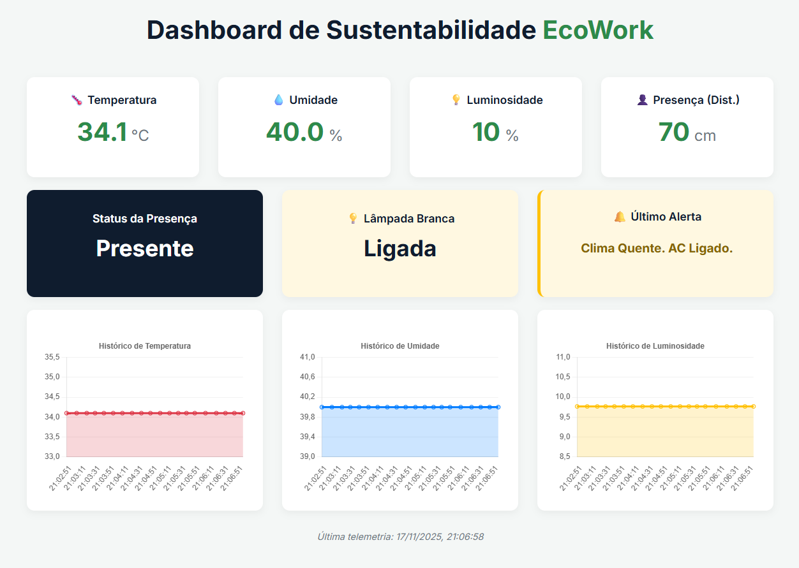

# 💡♻️ EcoWork Hub - Monitor de Sustentabilidade

**Tagline:** *Monitoramento IoT para um home office mais verde, inteligente e produtivo.*

\
<p align="center">\
\
\
\
\
\
\
\</p\>

-----

## 📖 Sobre o Projeto

O **EcoWork Hub** é uma solução de IoT (Internet das Coisas) desenvolvida como parte da **Global Solution** da FIAP para o desafio "O Futuro do Trabalho".

**O Problema:** O trabalho remoto e híbrido é o novo normal, mas traz um desafio: a falta de visibilidade do impacto ambiental (ESG) e do consumo de energia de milhares de "escritórios" domésticos.

**A Solução:** O EcoWork Hub é um dispositivo inteligente que monitora o ambiente de home office. Utilizando um **ESP32**, ele não apenas coleta dados, mas também **age** sobre eles em tempo real, ajudando o usuário a economizar energia e a empresa a medir sua pegada de carbono.

**Como funciona?**

1.  O **ESP32** lê os sensores de **presença** (HC-SR04), **luminosidade** (LDR) e **clima** (DHT22).
2.  **Localmente**, ele toma decisões:
      * Detecta **ausência** e desliga os periféricos (simulados pelos LEDs).
      * Detecta **luz natural** e sugere desligar a luz artificial (LED Branco).
      * Mostra o status e alertas em um **display LCD**.
3.  Simultaneamente, ele envia todos os dados (telemetria, status e alertas) para um **Broker MQTT** usando Wi-Fi.
4.  Um **aplicativo backend em Python** (Flask) se inscreve nos tópicos MQTT, recebe os dados e os processa.
5.  O backend envia os dados em tempo real para um **Dashboard Web** via **Socket.IO**, permitindo o monitoramento remoto por um gestor ou pelo próprio usuário.

-----

## ✨ Funcionalidades Principais

  - 👤 **Detecção de Presença (HC-SR04):** Identifica se o usuário está em sua estação de trabalho.
  - 🌡️💧 **Monitoramento de Clima (DHT22):** Mede temperatura e umidade para otimizar o uso de ar-condicionado.
  - 💡 **Leitura de Luminosidade (LDR):** Mede a luz ambiente para uma gestão inteligente da iluminação.
  - 🤖 **Lógica de Automação Local:**
      - **Modo Standby:** Ao detectar "Ausente", o ESP32 desliga automaticamente os LEDs de luz e clima.
      - **Gestão de Iluminação:** Se "Presente" e a luz ambiente estiver alta, desliga o LED de luz (lâmpada).
  - 🖥️ **Feedback Instantâneo (LCD):** Um display LCD 16x02 mostra alertas e o status do ambiente diretamente para o usuário.
  - 📡 **Comunicação MQTT (3 Tópicos):** Envia dados de forma organizada (`telemetria`, `status` e `alerta`).
  - 🐍 **Backend Python/Flask:** Um servidor robusto que atua como ponte entre o MQTT e o dashboard web.
  - 📊 **Dashboard Web em Tempo Real:** Exibe todos os KPIs (Temperatura, Umidade, Presença), o status da lâmpada, os alertas mais recentes e gráficos de histórico.

-----

## 📸 Telas do Projeto

  - **Simulação no Wokwi:** Visualização do circuito completo em funcionamento.
    \
  - **Dashboard Web:** O dashboard recebendo dados em tempo real do Wokwi.
    \

-----

## 🛠️ Tecnologias Utilizadas

| Categoria | Tecnologia | Descrição |
| :--- | :--- | :--- |
| **Hardware** | \ \ \ \ \ | Microcontrolador com Wi-Fi e sensores de ambiente/presença. |
| **Firmware** | \ | Código embarcado no ESP32 para leitura, automação e envio. |
| **Comunicação** | \ \ | Protocolo leve para dados IoT e conexão de rede sem fio. |
| **Backend** | \ \ \ \ | Recebe dados via MQTT e os serve para o dashboard web. |
| **Simulação** | \ | Plataforma online para simular o circuito e o código do ESP32. |

-----

## 🏗️ Arquitetura Simplificada

O fluxo de dados no sistema é o seguinte:

```mermaid
graph LR;
    Sensores[🌡️💧💡👤 Sensores DHT/LDR/HC-SR04] -->|Leitura| ESP32[💻 ESP32 (c/ LCD e LEDs)];
    ESP32 -->|Wi-Fi| BrokerMQTT[☁️ Broker MQTT (HiveMQ)];
    BrokerMQTT -->|Subscrição| Backend[🐍 Backend Python/Flask];
    Backend -->|Socket.IO| Dashboard[📊 Dashboard Web];
    Dashboard -->|Visualização| Usuario[👩‍💻 Usuário];

    style Sensores fill:#f9f,stroke:#333,stroke-width:2px;
    style ESP32 fill:#ccf,stroke:#333,stroke-width:2px;
    style BrokerMQTT fill:#fcf,stroke:#333,stroke-width:2px;
    style Backend fill:#ff9,stroke:#333,stroke-width:2px;
    style Dashboard fill:#9cf,stroke:#333,stroke-width:2px;
```

-----

## 🚀 Como Rodar o Projeto (Wokwi)

Este guia foca na simulação com Wokwi, que é a forma mais fácil de testar o projeto completo.

### 🧩 Pré-requisitos

1.  **Conta no Wokwi:** Gratuita em [wokwi.com](https://wokwi.com).
2.  **Python 3.7+:** Instalado em sua máquina.
3.  **Arquivos do Projeto:** Você precisará dos 3 arquivos principais:
      * `sketch.ino` (O código do ESP32)
      * `dashboard.py` (O servidor web)
      * `requirements.txt` (As dependências Python)

-----

### 🧪 Etapa 1: Iniciar a Simulação no Wokwi

1.  **Crie o Projeto:** Vá ao Wokwi e crie um novo projeto **ESP32**.
2.  **Adicione os Componentes:** Adicione ao seu diagrama:
      * `DHT22` (Sensor de Temp./Umidade)
      * `HC-SR04` (Sensor Ultrassônico)
      * `Módulo LDR` (KY-018 ou similar)
      * `LCD 16x02 I2C` (Display)
      * `3 LEDs` (Branco, Vermelho, Verde)
      * `3 Resistores` (valor de 220 Ohms)
3.  **Cole os Códigos:**
      * Copie o conteúdo de `sketch.ino` para a aba `sketch.ino` no Wokwi.
      * *Se você tiver um `diagram.json`*, cole-o na aba `diagram.json`.
4.  **Bibliotecas:** O Wokwi **não** precisa de `libraries.txt` para este projeto, pois o código C++ usa `WiFi.h` e `PubSubClient.h`, que são suportados nativamente na simulação de Wi-Fi.
5.  **Inicie a Simulação:** Clique no botão verde **▶️ (Start)**.
6.  **Verifique o Serial Monitor:** Na aba "Serial Monitor", você **deve** ver as seguintes mensagens:
      * `Conectando ao WiFi...Conectado!`
      * `Conectando ao MQTT...Conectado!`
      * *(Logs de telemetria sendo enviados)*

A simulação do Wokwi está agora enviando dados para o broker `broker.hivemq.com`.

-----

### 🐍 Etapa 2: Executar o Backend Python

1.  **Abra um Terminal:** Na pasta onde você salvou `dashboard.py` e `requirements.txt`.
2.  **(Opcional, mas recomendado) Crie um Ambiente Virtual:**
    ```bash
    python -m venv venv
    source venv/bin/activate  # No Windows: venv\Scripts\activate
    ```
3.  **Instale as Dependências:**
    ```bash
    pip install -r requirements.txt
    ```
4.  **Execute o Servidor:**
    ```bash
    python dashboard.py
    ```
5.  **Verifique o Terminal:** Você **deve** ver as seguintes mensagens:
      * `[Flask] Iniciando servidor web com SocketIO...`
      * `[MQTT] Conectado ao broker. Código: 0`
      * `[MQTT] Inscrito em: ecowork/telemetria ...`
      * *(Logs de mensagens MQTT sendo recebidas do Wokwi)*

-----

### 🧭 Etapa 3: Acessar o Dashboard

Com o Wokwi e o `dashboard.py` rodando, abra seu navegador e acesse:

👉 **[http://127.0.0.1:5000](http://127.0.0.1:5000)**

Você verá o dashboard ganhar vida\! Os dados do Wokwi viajarão para o broker MQTT, serão capturados pelo seu script Python e exibidos na sua tela em tempo real.

**Para testar:**

  * **Ausência:** Clique no sensor HC-SR04 no Wokwi e arraste o slider para longe. O status no dashboard mudará para "Ausente" e a lâmpada para "Desligada".
  * **Luz:** Clique no sensor LDR e arraste o slider. Você verá a porcentagem de luz mudar no dashboard.

-----

## 📡 Tópicos e Payloads MQTT

O projeto usa 3 tópicos distintos para organizar os dados:

### 1\. `ecowork/telemetria`

  * **Conteúdo:** O JSON principal com todos os dados dos sensores.
  * **Payload (Exemplo):**
    ```json
    {
      "temperatura": 24.5,
      "umidade": 55.1,
      "luminosidade": 3050,
      "distancia": 45
    }
    ```

### 2\. `ecowork/status`

  * **Conteúdo:** Uma string simples indicando a presença do usuário.
  * **Payload (Exemplo):** `"Presente"` ou `"Ausente"`

### 3\. `ecowork/alerta`

  * **Conteúdo:** Uma string simples com mensagens de economia de energia.
  * **Payload (Exemplo):** `"Luz artificial desligada (ambiente claro)"` ou `"Clima Frio. AC Desligado."`

-----

## ⚠️ Solução de Problemas Comuns

  - **Wokwi não conecta ao MQTT?**
    Verifique se o Wokwi está no modo "Wi-Fi" (na aba `diagram.json`, deve ter a conexão de Wi-Fi).

  - **Dashboard não atualiza (mas o Wokwi funciona)?**

      - Verifique se o `MQTT_BROKER` e os `MQTT_TOPIC`s são **idênticos** no `sketch.ino` (Wokwi) e no `dashboard.py` (Python).
      - Verifique o terminal do `dashboard.py`. Você está vendo as mensagens `[MQTT] Mensagem recebida...`? Se não, o problema está na comunicação MQTT.

  - **Dashboard mostra "Ligada" mesmo com "Ausente"?**

      - Você está usando a versão mais recente do `dashboard.py`. A lógica de `on_message` deve verificar o `ultimo_valor_status` antes de definir o status da lâmpada.

  - **LCD no Wokwi fica em branco?**

      - Verifique as conexões `SDA` e `SCL` (D21 e D22) e se o endereço no código (`LiquidCrystal_I2C lcd(0x27, 16, 2)`) está correto (0x27 é o padrão do Wokwi).

-----

## 👨‍💻 Desenvolvedor

**Gabriel Akira Borges Kiyohara — FIAP (1ESPJ)**

  * 📧 E-mail: [gakirakiyohara@gmail.com](mailto:gakirakiyohara@gmail.com)
  * 🐙 GitHub: [Gakira06](https://github.com/Gakira06)

-----

## 📄 Licença

Este projeto foi desenvolvido para fins acadêmicos como parte da Global Solution da FIAP.
Uso e modificação são permitidos dentro deste contexto.

© 2025 Gabriel Akira Borges Kiyohara